# Agentic Commerce Price and Inventory Audit

Date: 2026-04-29  
Repo: `pengxu9-rgb/pivota-backend`  
Audited commit: `92df0b2`

Note: the initial audit sections below record the pre-patch state. The “P0 Verification Results” and “P0/P1 Implementation Summary” sections record the current state after the commercial-correctness changes in this branch.

## Current Architecture Summary

Pivota has a cache-first discovery architecture with a partially live commerce path.

Product discovery reads local cached/indexed product data. Shopify products are fetched through `sync_shopify_products_for_merchant`, normalized through platform product adapters, upserted into `products_cache`, and optionally ingested into catalog tables. The catalog layer has normalized product, SKU, offer, price snapshot, inventory snapshot, sync event, and sync job tables.

Live quoting exists for Shopify. `/agent/v1/quotes/preview` calls `QuoteService.preview_quote`, which prefers Shopify Storefront Cart pricing and falls back to the Shopify REST Checkout pricing service. Quote snapshots are persisted with TTL in `quotes`.

Order creation is not yet fully quote-authoritative. `/agent/v1/orders/create` can require `quote_id` only when feature flags or checkout UI metadata demand it. When a quote is present, the order path verifies the request fingerprint against the quote request and then uses the stored quote snapshot amounts. It does not currently re-price/re-check the active quote live immediately before creating the Pivota order and PSP payment attempt.

Payment is generally Pivota-order first, PSP second, merchant-platform order third. A Pivota order is created, then a PSP payment intent/session is created. After PSP success, Stripe webhook or agent payment confirmation marks the Pivota order paid and triggers Shopify order creation. Shopify order creation is guarded by advisory locks and Shopify tags, but payment can succeed before the merchant order/inventory decrement succeeds.

Shopify webhooks are signed, persisted append-only with an idempotency key, and product webhooks can enqueue catalog reconciliation. Stripe webhooks verify signatures when configured but are not wired through the generic webhook idempotency table in the Stripe route.

Manual catalog reconciliation exists. A scheduled catalog reconciliation job was not found.

## Current Flow

```mermaid
flowchart LR
    A["Store platform products"] --> B["Product adapters normalize variants/SKUs"]
    B --> C["products_cache"]
    C --> D["catalog_products / catalog_skus / catalog_offers"]
    D --> E["Agent discovery/search"]
    E --> F["Quote preview"]
    F --> G["Shopify Storefront Cart or REST Checkout"]
    G --> H["quotes table with expires_at"]
    H --> I["Agent order create"]
    I --> J["Pivota order row"]
    J --> K["PSP payment intent/session"]
    K --> L["Stripe/agent payment confirmation"]
    L --> M["Shopify order create"]
    M --> N["Merchant platform decrements inventory"]
    N --> O["Shopify webhooks"]
    O --> C
```



## What Is Already Good

- Product adapters exist for Shopify, Wix, WooCommerce, and BigCommerce. The adapter factory dispatches all four platforms (`adapters/product_adapters.py:1418`).
- Shopify product normalization captures variant IDs, SKUs, barcodes, prices, compare-at prices, inventory quantities, currency, and orderable/in-stock flags (`adapters/product_adapters.py:374`, `adapters/product_adapters.py:488`).
- Shopify product sync pages through products, upserts `products_cache`, removes missing stale products, and ingests catalog rows (`services/shopify_products_sync.py:104`, `services/shopify_products_sync.py:208`, `services/shopify_products_sync.py:241`).
- Catalog tables model products, SKUs, offers, inventory snapshots, price snapshots, sync events, and sync jobs (`db/catalog.py:34`, `db/catalog.py:67`, `db/catalog.py:99`, `db/catalog.py:127`, `db/catalog.py:186`, `db/catalog.py:206`).
- Quote TTL exists. `QuoteService` defaults to `QUOTE_TTL_SECONDS=600`, computes `expires_at`, and persists quotes with `status`, `expires_at`, request JSON, snapshot JSON, and quote hash (`services/quote_service.py:179`, `services/quote_service.py:208`, `db/quotes.py:18`).
- Shopify quote preview calls live store pricing first via Storefront Cart, includes discounts/shipping/tax where Shopify returns them, and treats Shopify inventory rejections as hard failures (`services/quote_service.py:222`, `services/quote_service.py:231`, `services/quote_service.py:286`).
- Shopify Storefront pricing has a best-effort Admin GraphQL inventory policy check and raises `OUT_OF_STOCK` / `INSUFFICIENT_INVENTORY` when tracked DENY inventory is insufficient (`services/shopify_storefront_pricing_service.py:856`, `services/shopify_storefront_pricing_service.py:923`).
- Quote consumption is idempotency-aware at the table level: `mark_quote_consumed` only updates active quotes (`db/quotes.py:105`).
- Agent order creation has a best-effort idempotency key path; quote-first requests get a deterministic default key when one is omitted (`routes/agent_api.py:7714`, `routes/agent_api.py:7724`).
- Shopify order writeback has duplicate suppression through an advisory lock, existing linked order checks, and a Pivota order tag search (`routes/order_routes.py:3849`, `routes/order_routes.py:3869`, `routes/order_routes.py:3884`, `routes/order_routes.py:3932`).
- Shopify webhook ingestion verifies HMAC, persists raw events, and uses `(merchant_id, idempotency_key)` conflict handling for duplicates (`routes/webhook_routes.py:1247`, `routes/webhook_routes.py:1276`, `services/shopify_webhook_ingest.py:22`, `services/shopify_webhook_ingest.py:91`).
- Catalog reconciliation APIs and sync jobs exist for manual/operator-triggered reconcile (`routes/catalog_routes.py:79`, `routes/catalog_routes.py:152`, `services/catalog_sync_service.py:899`, `services/catalog_sync_service.py:1026`).

## Gaps and Risks

### P0

1. Final order creation does not live-revalidate the quote snapshot.
   - Evidence: order creation loads an active quote and validates request fingerprint, then reads totals from `quote.snapshot_json` (`routes/order_routes.py:2468`, `routes/order_routes.py:2518`, `routes/order_routes.py:2567`). There is no second live quote call before creating the order/payment.
   - Risk: price, discount, tax, shipping, or inventory can change inside TTL after the quote is shown but before payment is attempted.

2. Quote-first enforcement is still optional for general agent order creation.
   - Evidence: `should_require_quote_for_order_create` defaults to `mode=off` unless feature flags/tiering are enabled (`services/quote_first_enforcement.py:20`, `services/quote_first_enforcement.py:35`).
   - Risk: legacy order creates can still price from request payloads.

3. `/agent/v1/cart/validate` treats cached product price/inventory as validation.
   - Evidence: the endpoint reads `products_cache`, checks cached `in_stock`, calculates local shipping/tax, and returns `valid` with `in_stock: True` (`routes/agent_api.py:7324`, `routes/agent_api.py:7363`, `routes/agent_api.py:7406`, `routes/agent_api.py:7409`, `routes/agent_api.py:7429`).
   - Risk: agents may treat cached estimates as guaranteed checkout truth.

4. Inventory checks in the legacy order path are Shopify-only and fail open.
   - Evidence: non-Shopify returns `True`; missing credentials and Shopify API failures also allow the order (`routes/order_routes.py:1263`, `routes/order_routes.py:1274`, `routes/order_routes.py:1287`).
   - Risk: overselling or charging for unavailable goods when quote-first/live validation is bypassed or unavailable.

5. PSP success can precede merchant order creation/inventory decrement.
   - Evidence: order creation creates a PSP payment after the Pivota order (`routes/order_routes.py:2975`, `routes/order_routes.py:3013`). Stripe webhook and agent confirm mark the order paid and only then trigger Shopify order creation (`routes/webhook_routes.py:645`, `routes/webhook_routes.py:688`, `routes/agent_api.py:8680`, `routes/agent_api.py:8722`). Shopify order creation explicitly requires `payment_status == "paid"` (`routes/order_routes.py:3893`).
   - Risk: payment can succeed while merchant order creation fails or inventory is gone. This needs a larger authorization-first/platform-checkout design, but the smallest safe P0 mitigation is final live validation before payment initiation.

6. Stripe webhook processing is not centrally idempotent.
   - Evidence: the generic `WebhookService` supports idempotency and status updates (`services/webhook_service.py:120`, `services/webhook_service.py:214`, `services/webhook_service.py:264`), but the Stripe route handles events directly after signature parsing (`routes/webhook_routes.py:582`, `routes/webhook_routes.py:632`).
   - Risk: duplicate Stripe deliveries rely on downstream finalizer/order state rather than route-level event idempotency.

7. Shopify registration omits product/inventory topics.
   - Evidence: the handler reconciles catalog for `products/*` topics (`routes/webhook_routes.py:1300`), but the registration list includes orders, fulfillments, refunds, disputes, returns, GDPR topics, and no `products/create`, `products/update`, `products/delete`, or `inventory_levels/update` (`routes/webhook_routes.py:1885`).
   - Risk: cache/index can remain stale after merchant catalog or inventory changes.

### P1

1. No scheduled reconciliation was found for catalog price/inventory drift.
   - Evidence: manual reconcile endpoint and sync job exist (`routes/catalog_routes.py:152`, `services/catalog_sync_service.py:1026`), but repository search found no catalog reconciliation cron/scheduler beyond unrelated smoke/revenue jobs.

2. Quote response lacks an explicit agent-facing availability enum and source timestamp.
   - Evidence: `QuotePreviewResponse` contains `expires_at`, pricing, line items, currencies, and delivery options, but no `availability_status`, `available_quantity`, `is_final`, or `source_updated_at` (`models/quote.py:72`).

3. Non-Shopify live quote/availability is not implemented.
   - Evidence: adapters exist for Wix/WooCommerce/BigCommerce product discovery (`adapters/product_adapters.py:1418`), while quote services are Shopify-specific (`services/quote_service.py:182`).

4. Webhook out-of-order protection is incomplete.
   - Evidence: Shopify event persistence records `occurred_at` and duplicate IDs, but product/cache mutation is a full sync job rather than versioned event application. Order/payment handlers rely on terminal state checks and service-level reconciliation.

5. Shopify Storefront inventory policy enforcement can fail open if the Admin inventory call fails.
   - Evidence: code comments state Admin inventory API failure returns `{}` and fail-open behavior (`services/shopify_storefront_pricing_service.py:856`, `services/shopify_storefront_pricing_service.py:946`).

### P2

1. Metrics are scattered and not complete for quote latency/failure, checkout validation failure, stale SKU count, webhook failure, and reconciliation drift.
2. Admin visibility exists for catalog jobs and some dashboards, but not a focused commercial correctness dashboard.
3. Quote/checkout public API docs do not clearly state cached-vs-live semantics for agent clients.

## Product Sync Findings

- Products are imported through universal product adapters and specific Shopify sync code.
- Product details are stored in `products_cache` and normalized catalog/canonical tables.
- Shopify, Wix, WooCommerce, and BigCommerce connectors are present for product import.
- Variants/SKUs are normalized into `StandardProductVariant`, `catalog_skus`, and canonical variants.
- Currency is represented in adapters/catalog/quotes. Catalog offers include `channel`. Market/country/locale/customer group are partially present in checkout intent and quote request context, but not consistently represented as source-of-truth pricing dimensions across all product/cache tables.

## Price Handling Findings

- Discovery and `/cart/validate` can read cached product prices.
- Shopify quote preview fetches live store pricing using Shopify Storefront Cart or REST Checkout fallback.
- Quote TTL/expiration is implemented.
- Order creation uses quote snapshot pricing when `quote_id` is supplied, but does not live-revalidate the quote snapshot immediately before payment intent/session creation.
- Discounts, shipping, and tax are included when returned by Shopify quote engines. Legacy `/cart/validate` uses local placeholder shipping/tax and is not commercially authoritative.
- Non-Shopify price quoting is not implemented.

## Inventory Handling Findings

- Inventory is cached locally in product payloads, catalog offers, and inventory snapshots.
- Inventory cache updates come from product sync, manual catalog reconciliation, and Shopify product-webhook-triggered catalog sync if those topics are delivered.
- Shopify quote preview has a best-effort live inventory policy check.
- Legacy order inventory check is Shopify-only and fail-open.
- No platform-native reservation/hold is implemented in Pivota. Inventory decrement/reservation happens when the merchant platform accepts the order/checkout, not through Pivota cache.

## Checkout and Payment Findings

- Agent discovery can create checkout intents without live quote; purchase/order paths may later require a quote depending on flags/surface.
- Agent order create supports idempotency keys and quote fingerprint matching.
- Pivota creates local orders and PSP payment intents/sessions before merchant order creation.
- Payment success + merchant order failure remains a commercial risk. Existing aftercare/reconciliation can retry missing Shopify orders (`routes/order_routes.py:4695`), but that is not equivalent to authorization-first or platform-native checkout reservation.
- Existing Stripe integration uses modern PaymentIntent/Checkout Session concepts rather than legacy Charges/Sources. The P0 gap is ordering/safety around merchant order feasibility, not the Stripe API surface itself.

## Webhook Findings

- Shopify consumed topics include order, fulfillment, refund, tender transaction, dispute, return, app uninstall, and product topics when received.
- Shopify webhooks are idempotent at ingest and can update Pivota cache/index through catalog sync jobs.
- Stripe webhooks verify signatures when secrets are configured but lack route-level persistence/idempotency.
- Generic webhook event persistence exists with retry count and status fields, but it is not consistently used by all PSP routes.
- Webhooks are not the primary inventory decrement mechanism; Shopify order creation is the merchant-side decrement mechanism.

## Reconciliation Findings

- Manual/operator-triggered catalog reconcile exists.
- No scheduled recurring reconciliation was found for catalog/price/inventory/order drift.
- Paid-order missing-Shopify reconciliation exists as an ops endpoint intended for cron/manual use (`routes/order_routes.py:4695`), but no scheduler was found.

## Agent-Facing API Findings

- Agent product discovery/search uses cached/indexed product data.
- `/agent/v1/quotes/preview` and `/agent/v2/quotes/preview` provide live Shopify quote TTL.
- `/agent/v1/cart/validate` returns cached validation without explicit stale/estimated/final semantics.
- Agent-facing purchase intent/order create can still proceed through legacy paths unless quote-first flags/surfaces require a quote.

## Target Architecture

Discovery should continue to use local cache/index for speed. Cached price and inventory must be described as estimated/stale unless refreshed by a live quote.

Quote should be the authoritative pre-purchase validation step. The quote response should include TTL, source timestamp, explicit availability status, and final-vs-estimated flags. Shopify can use Storefront Cart plus Admin inventory policy checks. Wix/WooCommerce/BigCommerce need platform-specific live quote/availability adapters before they can be treated as purchase-ready.

Checkout/order creation must live-revalidate the quote/cart immediately before creating a Pivota order/payment attempt. If the live quote differs from the active quote snapshot, the request should fail with a refresh/requote error rather than charging.

Payment should move toward authorization-first or platform-native checkout where possible. If Pivota keeps creating PSP payment before merchant order, it must fail closed on final validation and provide recovery/void/refund workflows for payment success + merchant order failure.

Webhooks should update cache/index after source-of-truth changes. All PSP/platform webhook routes should persist event IDs, skip processed duplicates, and retain failed events for retry/ops visibility. Out-of-order state application should use event timestamps or platform updated timestamps where incremental mutation is used.

Reconciliation should run on a schedule and compare catalog price/inventory/order state against store-platform truth, logging drift and updating cache.

## Recommended Implementation Plan

### Smallest Safe P0 Patch

1. Add final live quote validation before quote-first order creation uses the stored snapshot.
   - Reuse `QuoteService.preview_quote` in a non-persisting validation mode.
   - Compare live pricing/currency/line quantities with the stored quote snapshot.
   - Reject with a clear quote stale/reprice error if price, discount, tax, shipping, line price, or availability changed.

2. Mark `/agent/v1/cart/validate` as cache-only/estimated.
   - Add response fields such as `price_source=products_cache_estimate`, `is_final=false`, `requires_quote=true`, and item `availability_status=unknown_requires_validation`.
   - Preserve existing fields for backward compatibility.

3. Wire Stripe webhook route through generic webhook event idempotency.
   - Record Stripe event ID after signature verification.
   - Skip events already marked processed/ignored.
   - Mark processed/failed after handling.

4. Register and handle Shopify product/inventory cache topics.
   - Add `products/create`, `products/update`, `products/delete`, and `inventory_levels/update` to registration.
   - Treat inventory-level webhook delivery as a cache/catalog reconcile trigger.

### P1 Follow-Up

1. Add scheduled catalog reconciliation for Shopify first, then other platforms.
2. Add explicit quote availability enum and source timestamp to `QuotePreviewResponse`.
3. Add non-Shopify live quote/availability adapters or mark those platforms `unknown_requires_validation` for purchase until implemented.
4. Harden Shopify quote inventory checks to fail closed when Admin inventory policy lookup is unavailable for tracked Shopify variants.

### P2 Follow-Up

1. Add metrics for quote latency/failure, checkout validation failure, webhook duplicate/failure, reconciliation drift, and stale SKUs.
2. Add an admin commercial-correctness dashboard.
3. Expand public API docs and platform limitation docs.

## P0 Patch Notes

Implemented after this audit:

- Quote-first order creation now performs a live source-of-truth quote revalidation before using the stored quote snapshot to create the Pivota order/payment attempt. If live price, shipping, tax, discount, currency, line item price, or availability no longer matches the stored quote, order creation fails with `QUOTE_STALE_REPRICE_REQUIRED` or the platform inventory error.
- `QuoteService.preview_quote` supports non-persisting/non-analytics validation calls so final checkout validation does not create an extra active quote.
- `/agent/v1/cart/validate` remains backward compatible but now explicitly marks its output as cached estimates:
  - top-level `validation_source=products_cache_estimate`
  - top-level `requires_quote=true`
  - top-level `quote_required_before_purchase=true`
  - top-level `inventory_guarantee=not_guaranteed`
  - `pricing.price_source=products_cache_estimate`
  - `pricing.is_final=false`
  - item `availability_status=unknown_requires_validation`
- Stripe webhook handling now records/checks Stripe event IDs through the generic `webhook_events` idempotency service best-effort and skips events already marked processed/ignored.
- Shopify webhook registration now includes `products/create`, `products/update`, `products/delete`, and `inventory_levels/update`; product and inventory webhooks both enqueue catalog/cache reconciliation.

## P0 Verification Results

### A. Final live quote revalidation

Status: Verified.

Evidence:
- `QuoteService.validate_quote_snapshot_live` calls `preview_quote(..., persist=False, emit_analytics=False)` and compares the active quote snapshot with a fresh Shopify quote (`services/quote_service.py:540`).
- Mismatches raise `QUOTE_STALE_REPRICE_REQUIRED`; Shopify inventory errors such as `OUT_OF_STOCK` and `INSUFFICIENT_INVENTORY` propagate from the live quote path (`services/quote_service.py:569`).
- Comparison covers currency, subtotal, discount total, shipping fee, tax, total, line item product/variant IDs, quantities, unit prices, and line discounts (`services/quote_service.py:592`).
- Order creation performs this live validation after quote load/fingerprint checks and before Pivota order creation or PSP creation (`routes/order_routes.py:2542`, `routes/order_routes.py:2642`, `routes/order_routes.py:3058`).

Risk remaining:
- Availability is confirmed by successful Shopify quote/inventory policy checks or rejected by platform errors. Pivota still does not reserve inventory before PSP success.
- Shopify Admin inventory policy lookup remains best-effort in the Storefront quote engine; if Shopify inventory metadata is unavailable, Pivota relies on Shopify quote/cart behavior.

Files inspected:
- `services/quote_service.py`
- `routes/order_routes.py`
- `tests/test_quote_live_revalidation.py`
- `tests/test_quote_first_order_persistence.py`

Tests:
- `tests/test_quote_live_revalidation.py`
- `tests/test_quote_first_order_persistence.py::test_live_revalidation_failure_blocks_order_and_psp`

### B. Non-persisting quote validation mode

Status: Verified.

Evidence:
- `QuoteService.preview_quote` accepts `persist` and `emit_analytics` flags (`services/quote_service.py:185`).
- Analytics emission is gated by `emit_analytics` (`services/quote_service.py:398`).
- Quote insertion is gated by `persist` (`services/quote_service.py:481`).
- Final validation calls `preview_quote` with both disabled (`services/quote_service.py:556`).

Risk remaining:
- None found for duplicate quote rows/analytics pollution in final validation.

Files inspected:
- `services/quote_service.py`
- `tests/test_quote_live_revalidation.py`

Tests:
- `tests/test_quote_live_revalidation.py::test_validate_quote_snapshot_live_matching_quote_does_not_persist_or_emit`

### C. `/agent/v1/cart/validate` cache-only semantics

Status: Verified.

Evidence:
- Response now includes `validation_source=products_cache_estimate`, `requires_quote=true`, `quote_required_before_purchase=true`, and `inventory_guarantee=not_guaranteed` (`routes/agent_api.py:7433`).
- `pricing.price_source=products_cache_estimate`, `pricing.is_final=false`, and `pricing.requires_quote=true` are present (`routes/agent_api.py:7442`).
- Items include `availability_status=unknown_requires_validation`, `availability_source=products_cache_estimate`, `inventory_guarantee=not_guaranteed`, and `price_source=products_cache_estimate` while preserving legacy `valid`, `items`, `pricing`, and `in_stock` fields (`routes/agent_api.py:7398`).

Risk remaining:
- Some older clients may still read legacy `valid/in_stock` fields without looking at the new estimate flags; API docs now state this endpoint is not final checkout validation.

Files inspected:
- `routes/agent_api.py`
- `tests/test_agent_cart_validate.py`

Tests:
- `tests/test_agent_cart_validate.py`

### D. Stripe webhook idempotency

Status: Partially verified.

Evidence:
- Stripe event IDs are derived from `event.id` or a payload hash fallback (`routes/webhook_routes.py:526`).
- The Stripe route uses the generic `WebhookService.check_duplicate_event`, `record_webhook_event`, and `update_event_status` path (`routes/webhook_routes.py:534`, `routes/webhook_routes.py:712`, `routes/webhook_routes.py:1081`).
- Already processed duplicates return early and do not mutate order state (`routes/webhook_routes.py:721`).
- Failed webhook processing is marked `failed` best-effort in exception handlers (`routes/webhook_routes.py:1084`).

Risk remaining:
- Persistence is intentionally best-effort; if the webhook event table is unavailable, the route logs and continues so a valid Stripe event is not dropped. That means route-level duplicate protection is not guaranteed during idempotency-store outages, although downstream order finalizers remain state-checked.

Files inspected:
- `routes/webhook_routes.py`
- `services/webhook_service.py`
- `tests/test_stripe_webhook_contract.py`

Tests:
- `tests/test_stripe_webhook_contract.py::test_stripe_webhook_duplicate_event_is_skipped`
- `tests/test_stripe_webhook_contract.py::test_stripe_webhook_payment_intent_succeeded_marks_paid_and_creates_shopify_order`

### E. Shopify webhook registration and catalog/cache updates

Status: Verified.

Evidence:
- Webhook registration includes `products/create`, `products/update`, `products/delete`, and `inventory_levels/update` (`routes/webhook_routes.py:1979`).
- Product and inventory topics persist through Shopify webhook ingest and enqueue catalog sync jobs (`routes/webhook_routes.py:1387`).
- Duplicate Shopify webhooks return before catalog job creation because `ingest_shopify_webhook` reports duplicates (`routes/webhook_routes.py:1363`).

Risk remaining:
- Product/inventory webhooks trigger full catalog/cache reconciliation rather than versioned event application. This is safer for out-of-order delivery but can be heavier and depends on the reconciliation job completing.

Files inspected:
- `routes/webhook_routes.py`
- `services/shopify_webhook_ingest.py`
- `tests/test_stripe_webhook_contract.py`

Tests:
- `tests/test_stripe_webhook_contract.py::test_shopify_product_inventory_webhooks_enqueue_catalog_reconcile`
- `tests/test_stripe_webhook_contract.py::test_shopify_duplicate_webhook_skips_catalog_reconcile`

## P0/P1 Implementation Summary

What is now fixed:

- A unified `CommerceExecutionPolicy` now separates `pivota_direct_quote_first`, `external_platform_checkout`, `legacy_admin`, and `unsupported` commerce paths. Public agent order/payment paths allow only `pivota_direct_quote_first`; external platform checkout creates no Pivota order and no PSP payment.
- Additive response fields now expose `commerce_path`, `execution_policy`, `legacy_or_fallback`, and `validation_authority` on the updated agent-facing purchase/checkout/cache-estimate surfaces.
- Legacy/admin order creation remains backward-compatible but is tagged as `legacy_admin` / `legacy_or_fallback=true` in order metadata when no explicit commerce path is provided. This keeps legacy/fallback traffic auditable and prevents it from implicitly becoming Pivota-direct agent purchase.
- Direct quote-first orders are isolated from platform checkout fallback helpers. If the fallback flag is enabled and a direct order attempts to use cache/external checkout as a final payment fallback, the code records a `fallback_pollution_attempt` event instead of returning a platform checkout URL.
- `/agent/v1/cart/validate` remains cache-only and now also returns policy fields with `validation_authority=cache_estimate`; its pricing remains `is_final=false` and inventory remains `not_guaranteed`.
- Agent-facing `/agent/v1/orders/create` now always requires `quote_id` and returns `QUOTE_REQUIRED_BEFORE_PURCHASE` before creating orders or PSP surfaces.
- `/agent/v1/checkout/intents` now requires an active quote for raw item payloads; existing-order checkout resume remains allowed.
- Deprecated `/agent/pay` and `/agent/pay-simple` are disabled with `410` and `QUOTE_REQUIRED_BEFORE_PURCHASE`.
- `/agent/v1/payments` refuses PSP payment creation unless the order metadata contains a live-validated pricing quote that has not expired.
- Quote-first order creation still performs final live validation before order/PSP creation; failed price, currency, quantity, line, or inventory validation blocks PSP calls.
- Paid orders that fail merchant order creation are marked in `metadata.merchant_order` as `paid_merchant_order_failed` with `requires_action=requires_refund_or_retry`; `metadata.payment_recovery` now marks `refund_required=true` and gives the operator action `retry_merchant_order_or_issue_refund`.
- Ops can query paid-without-merchant-order failures through `GET /orders/ops/merchant-order-failures` and retry one order through `POST /orders/ops/merchant-order-failures/{order_id}/retry`.
- Ops can trigger an idempotent PSP refund for captured paid-without-merchant-order failures through `POST /orders/ops/merchant-order-failures/{order_id}/refund`.
- Merchant-order retry emits `merchant_order_retry_success`, `merchant_order_retry_pending`, or `merchant_order_retry_failed` best-effort events; duplicate retries skip already-linked orders.
- Ops can query transaction-safety counters through `GET /orders/ops/transaction-safety/metrics`, including paid merchant-order failures, retry success/failure, quote revalidation failure, reconciliation drift, webhook duplicate, webhook failure, and fallback pollution attempt counts.
- Transaction-safety metrics now also expose auth-first payment lifecycle counters: `payment_authorized_count`, `payment_captured_after_merchant_order_count`, `payment_capture_failed_count`, and `payment_authorization_void_failed_count`.
- Stripe PaymentIntent and Stripe Checkout Session primitives now support manual capture metadata, idempotent capture, and cancel authorization at the adapter layer.
- Authorization-first order finalization is implemented behind `FF_ENABLE_AUTHORIZATION_FIRST_ORDERS=true` and `FF_ENABLE_STRIPE_MANUAL_CAPTURE=true` for Stripe PaymentIntent/Checkout Session + Shopify store-platform pairs. Pivota treats `requires_capture` as authorized, writes the Shopify merchant order first, captures Stripe only after merchant writeback succeeds, and cancels the authorization if merchant writeback fails before capture.
- PayPal Orders v2 authorization/capture primitives are implemented at the adapter layer and can be used for the Shopify auth-first order flow behind `FF_ENABLE_AUTHORIZATION_FIRST_ORDERS=true` and `FF_ENABLE_PAYPAL_AUTHORIZATION_FIRST=true`. Pivota creates PayPal orders with `intent=AUTHORIZE`, confirms approved orders through PayPal authorize, writes the Shopify merchant order before capture, captures the authorization idempotently, and voids it if merchant order writeback fails before capture.
- Adyen and Checkout.com now expose idempotent capture/cancel primitives at the adapter/capability layer, and Checkout.com `Authorized` status is no longer normalized as captured/succeeded. Their order-level auth-first flows remain disabled because the current Sessions/webhook flow does not yet synchronously prove final capture completion.
- Generic paid-transition verification no longer treats `authorized` / `authorised` as captured payment; those states are accepted only inside the explicit auth-first flow.
- Shopify quote responses now include `availability_status`, `available_quantity`, `is_final`, `source_updated_at`, `expires_at`, and `warnings`.
- Store-platform capability flags were added for Shopify, Wix, WooCommerce, and BigCommerce, including live quote, live inventory, platform checkout, platform order writeback, reservation, and inventory hold markers.
- PSP capability flags were added for Stripe, Adyen, Checkout.com, and PayPal, including authorize/capture, void authorization, and auto-refund markers. Agent v2 merchant capabilities now expose both store-platform and PSP capability blocks.
- Captured-payment recovery uses the generic PSP refund path rather than a Stripe-only path. Adyen, Checkout.com, and PayPal refund adapters now accept idempotency keys; PayPal payment creation, confirmation, status, and token-cache behavior now match the common PSP interface expectations.
- `POST /agent/v1/checkout/external-platform` provides a safe external platform checkout path for platforms that can host their own checkout but do not yet have Pivota live quote adapters. It does not create a Pivota order or PSP payment; final price, tax, shipping, payment, inventory availability, and inventory decrement stay with the merchant platform checkout.
- WooCommerce and BigCommerce capabilities now distinguish external platform checkout redirects from Pivota direct purchase readiness. Current verified semantics are limited to best-effort single simple product checkout/cart redirects; unsupported cart shapes fail closed.
- Agent v2 merchant capabilities now expose `supported_flows.external_platform_checkout` separately from `supported_flows.pivota_direct_checkout`, while preserving the older `hosted_checkout` compatibility flag.
- A cron-compatible reconciliation job exists at `jobs/agentic_commerce_reconciliation.py`; it reconciles Shopify product/cache/catalog data and retries recently paid orders missing merchant orders.
- `docs/agentic-commerce-transaction-safety-next-phase.md` documents the remaining inventory-hold, authorization-first, void/refund, observability, and rollout architecture.

What remains:

- Authorization-first is not enabled by default and currently applies only to Stripe PaymentIntent/Checkout Session + Shopify or PayPal Orders + Shopify when the global flag and provider-specific flag are enabled. Adyen, Checkout.com, WooCommerce, BigCommerce, and Wix remain on the existing fail-closed/captured-payment recovery behavior until each pair is implemented and tested end-to-end.
- Automatic void is wired for uncaptured Stripe and PayPal authorizations in their feature-flagged Shopify auth-first flows. Captured-payment refund recovery remains available through an idempotent ops endpoint; current safe recovery is visible failure state, queryable ops endpoint, best-effort metrics, idempotent retry/reconciliation, and explicit refund-required operator action.
- Non-Shopify live quote/availability adapters are not implemented. WooCommerce and BigCommerce may use external platform checkout redirects for supported simple carts; Wix remains discovery-only until a verified checkout or live quote adapter is added.
- Scheduled execution must be configured by deployment/ops, for example cron/Railway/GitHub Actions running `python -m jobs.agentic_commerce_reconciliation`.

## Store Platform Capability Matrix

| Platform | Discovery cache | Live quote | Live inventory check | Platform checkout | Platform order writeback | Inventory reservation/hold | Purchase behavior |
| --- | --- | --- | --- | --- | --- | --- | --- |
| Shopify | Yes | Yes | Yes, best-effort Admin inventory policy plus Shopify quote/cart rejection | Yes | Yes | No explicit reservation or hold; auth-first can write merchant order before Stripe capture | Purchase-ready only with live quote and final revalidation |
| Wix | Yes | No | No | No verified adapter | No | No | Fail closed or require merchant checkout validation |
| WooCommerce | Yes | No | No | Yes, external platform checkout redirect for supported simple carts | Yes | No | Direct Pivota purchase fails closed without live quote; external checkout lets WooCommerce validate final price/inventory/payment |
| BigCommerce | Yes | No | No | Yes, external platform checkout redirect for supported simple carts | Yes | No | Direct Pivota purchase fails closed without live quote; external checkout lets BigCommerce validate final price/inventory/payment |

## PSP Capability Matrix

| PSP | Refund recovery | Authorize/capture primitives | Void authorization | Default order-flow auth-first | Notes |
| --- | --- | --- | --- | --- | --- |
| Stripe | Yes | PaymentIntent and Checkout Session manual capture supported | Uncaptured authorization cancel supported | Feature-flagged for Shopify PaymentIntent and Checkout Session flows | Checkout Session auth-first depends on `payment_intent.amount_capturable_updated` or `checkout.session.completed` finalization |
| Adyen | Yes | Capture/cancel primitives available; manual capture setup must be proven per merchant | Cancellation supported by adapter | No | Sessions/webhook capture finalization is async, so order-flow auth-first stays off |
| Checkout.com | Yes | Capture/void primitives available; authorize session creation not wired | Void supported by adapter | No | `Authorized` is treated as `requires_capture`, not `succeeded` |
| PayPal | Yes | Orders v2 `AUTHORIZE` plus authorization capture supported | Authorization void supported | Feature-flagged for Shopify Orders flow | Redirect approval still requires backend authorize before merchant writeback/capture |

## How To Test

Targeted test commands run:

```bash
python3 -m py_compile routes/agent_api.py routes/agent_checkout_intents.py routes/agent_payment_sdk.py routes/agent_routes.py routes/order_routes.py routes/quote_routes.py routes/agent_v2.py services/quote_service.py services/platform_capabilities.py jobs/agentic_commerce_reconciliation.py models/quote.py
python3 -m py_compile services/refund_service.py adapters/psp_adapter.py adapters/checkout_adapter.py adapters/paypal_adapter.py services/psp_capabilities.py tests/test_psp_recovery_interfaces.py
python3 -m pytest tests/test_psp_recovery_interfaces.py tests/test_refund_service_canonical_runtime.py tests/test_platform_capabilities.py tests/test_agent_v2_contract.py -q
python3 -m pytest tests/test_psp_recovery_interfaces.py tests/test_platform_capabilities.py tests/test_authorization_first_flow.py -q
python3 -m pytest tests/test_quote_first_order_persistence.py tests/test_quote_live_revalidation.py tests/test_agent_cart_validate.py tests/test_quote_first_replay_idempotency.py tests/test_buyer_vault_mvp.py tests/test_stripe_webhook_contract.py tests/test_merchant_order_failure_recovery.py tests/test_platform_capabilities.py tests/test_quote_service_serialization.py tests/test_agent_v2_contract.py tests/test_stripe_payment_element_runtime.py tests/test_psp_recovery_interfaces.py tests/test_refund_service_canonical_runtime.py tests/test_authorization_first_flow.py tests/test_agent_payment_sdk_existing_surface.py tests/test_agent_confirm_payment_contract.py tests/test_order_payment_verification.py -q
python3 -m py_compile routes/agent_checkout_intents.py routes/agent_v2.py services/platform_capabilities.py tests/test_agent_external_platform_checkout.py tests/test_platform_capabilities.py
python3 -m pytest tests/test_agent_external_platform_checkout.py tests/test_platform_capabilities.py tests/test_agent_v2_contract.py tests/test_order_routes_platform_checkout_fallback.py -q
python3 -m py_compile adapters/checkout_adapter.py adapters/paypal_adapter.py adapters/psp_adapter.py config/feature_flags.py jobs/agentic_commerce_reconciliation.py models/quote.py routes/agent_api.py routes/agent_checkout_intents.py routes/agent_payment_sdk.py routes/agent_routes.py routes/agent_v2.py routes/order_routes.py routes/quote_routes.py routes/webhook_routes.py services/platform_capabilities.py services/psp_capabilities.py services/quote_service.py services/refund_service.py
python3 -m pytest tests/test_quote_first_order_persistence.py tests/test_quote_live_revalidation.py tests/test_agent_cart_validate.py tests/test_quote_first_replay_idempotency.py tests/test_buyer_vault_mvp.py tests/test_stripe_webhook_contract.py tests/test_merchant_order_failure_recovery.py tests/test_platform_capabilities.py tests/test_quote_service_serialization.py tests/test_agent_v2_contract.py tests/test_stripe_payment_element_runtime.py tests/test_psp_recovery_interfaces.py tests/test_refund_service_canonical_runtime.py tests/test_authorization_first_flow.py tests/test_agent_payment_sdk_existing_surface.py tests/test_agent_confirm_payment_contract.py tests/test_order_payment_verification.py tests/test_agent_external_platform_checkout.py tests/test_order_routes_platform_checkout_fallback.py tests/test_shopify_order_sync_hardening.py tests/test_agent_order_create_idempotency.py tests/test_checkout_webhook_contract.py tests/test_merchant_payment_initiation_service.py tests/test_multi_psp_orchestrator_preferred_subset.py -q
```

Result: PSP capability/auth-first focused tests pass with `26 passed`; the commercial correctness/auth-first suite now passes with `128 passed, 2 warnings`.

External platform checkout regression tests pass with `23 passed, 2 warnings`.

Agent v2 capability/external checkout/platform capability focused tests pass with `17 passed`.

Stripe Checkout manual-capture/auth-first focused tests pass with `49 passed, 1 warning`.

Combined commercial correctness, PSP recovery, auth-first, external checkout, webhook, and fallback regression suite passes with `176 passed, 4 warnings`.

Additional regression command run:

```bash
python3 -m pytest tests/test_order_routes_platform_checkout_fallback.py tests/test_shopify_order_sync_hardening.py tests/test_agent_order_create_idempotency.py -q
```

Result: `22 passed, 2 warnings`.

Commerce execution policy and isolation regression command run:

```bash
python3 -m pytest tests/test_commerce_execution_policy.py tests/test_agent_cart_validate.py tests/test_agent_external_platform_checkout.py tests/test_order_routes_platform_checkout_fallback.py tests/test_merchant_order_failure_recovery.py tests/test_quote_first_replay_idempotency.py tests/test_agent_payment_sdk_existing_surface.py -q
```

Result: `44 passed, 4 warnings`.

Final combined commercial correctness regression command run:

```bash
python3 -m pytest tests/test_quote_first_order_persistence.py tests/test_quote_live_revalidation.py tests/test_agent_cart_validate.py tests/test_quote_first_replay_idempotency.py tests/test_buyer_vault_mvp.py tests/test_stripe_webhook_contract.py tests/test_merchant_order_failure_recovery.py tests/test_platform_capabilities.py tests/test_quote_service_serialization.py tests/test_agent_v2_contract.py tests/test_stripe_payment_element_runtime.py tests/test_psp_recovery_interfaces.py tests/test_refund_service_canonical_runtime.py tests/test_authorization_first_flow.py tests/test_agent_payment_sdk_existing_surface.py tests/test_agent_confirm_payment_contract.py tests/test_order_payment_verification.py tests/test_agent_external_platform_checkout.py tests/test_order_routes_platform_checkout_fallback.py tests/test_shopify_order_sync_hardening.py tests/test_agent_order_create_idempotency.py tests/test_checkout_webhook_contract.py tests/test_merchant_payment_initiation_service.py tests/test_multi_psp_orchestrator_preferred_subset.py tests/test_commerce_execution_policy.py -q
```

Result: `184 passed, 5 warnings`.

Known local environment gap: `tests/test_runtime_interface_drift.py` was not rerun in the final pass because earlier health checks failed before these changes due to the local `DATABASE_URL` pointing to a Postgres role that does not exist (`role "user" does not exist`).

## Example Scenarios

- Price changed after agent recommendation: order create reloads the quote, performs live quote validation, detects pricing mismatch, returns `QUOTE_STALE_REPRICE_REQUIRED`, and does not call PSP.
- Inventory changed after agent recommendation: live quote/Shopify inventory rejection propagates as `OUT_OF_STOCK` or `INSUFFICIENT_INVENTORY`, and PSP is not called.
- Last item bought by another buyer: same as inventory changed; Shopify remains the source of truth and Pivota does not trust cache.
- Payment succeeds but merchant order creation fails: order metadata is marked `paid_merchant_order_failed`, payment recovery is marked `refund_required`, ops can query the failure, retry is idempotent, and captured payment can be refunded through the idempotent ops recovery endpoint.
- Stripe authorization succeeds but Shopify order creation fails before capture: auth-first finalization cancels the Stripe authorization, marks recovery metadata as `authorization_voided`, and does not capture payment.
- Stripe authorization succeeds and Shopify order creation succeeds: auth-first finalization captures the PaymentIntent, including one resolved from a Checkout Session, with an order-scoped idempotency key and marks the order paid only after capture succeeds.
- PayPal approval succeeds in a feature-flagged Shopify auth-first flow: backend converts the approved PayPal order into an authorization, creates the Shopify order, captures the authorization with `auth_first_capture:{order_id}`, and marks paid only after capture.
- PayPal authorization succeeds but Shopify order creation fails before capture: auth-first finalization voids the PayPal authorization with `auth_first_void:{order_id}` and does not capture payment.
- WooCommerce/BigCommerce external platform checkout: `/agent/v1/checkout/external-platform` returns a platform checkout redirect without creating a Pivota order or PSP payment. The response marks Pivota pricing as not final and availability as `unknown_requires_validation`.
- Unsupported non-Shopify checkout shapes: external checkout returns `EXTERNAL_PLATFORM_CHECKOUT_UNAVAILABLE` and direct Pivota purchase remains blocked unless a live quote is present.
- Webhook duplicate delivery: Stripe duplicate events are skipped via webhook event ID; Shopify duplicate product/inventory webhooks skip catalog job creation.
- Webhook delayed delivery: Shopify product/inventory webhooks enqueue full reconciliation rather than applying incremental stale event state.
- Webhook out-of-order delivery: full sync reconciliation is used for catalog/cache mutation, reducing corruption risk from event ordering.
- Reconciliation detects inventory drift: the scheduled job refreshes Shopify products into `products_cache` and runs catalog reconciliation; drift is reflected in cache/catalog rows and job stats/logs.

## Remaining Commercial Risk Level

Remaining risk is P1 for Shopify quote-first flows after these changes: final validation, quote TTL, PSP gating, webhook idempotency, recovery visibility/retry, captured-payment refund recovery, and feature-flagged Stripe/PayPal authorization-first are in place. True inventory reservation is still not implemented.

Remaining direct-purchase risk for non-Shopify public agent paths is mitigated by fail-closed quote gates. WooCommerce and BigCommerce now have a constrained external checkout escape hatch that delegates final validation to the platform and does not create Pivota payment/order state. Non-Shopify Pivota-direct purchase readiness remains a P0 capability gap if any future path bypasses live quote or external merchant checkout validation; cached non-Shopify product data must not be treated as final purchase truth.
