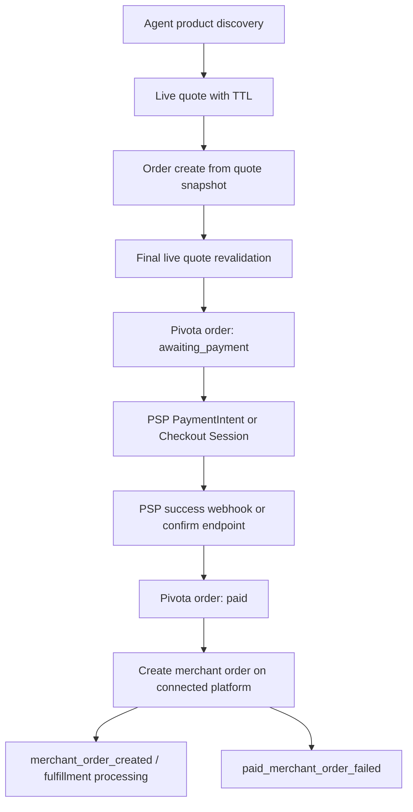

# Agentic Commerce Transaction Safety Next Phase

Date: 2026-04-29

This note covers the transaction-safety work that remains after the quote-first, PSP pre-validation, platform fail-closed, webhook idempotency, and reconciliation scaffolding changes.

## Current State Machine

Current agent order flow for connected store platforms:

Important properties already present:

- Agent-facing order creation requires a live quote and performs final quote revalidation before creating the PSP surface.
- Stripe webhooks are event-id idempotent.
- Merchant order creation has duplicate controls: Pivota order link re-check, platform-specific idempotency guards, and for Shopify specifically a PostgreSQL advisory lock plus Shopify tag lookup using the Pivota order id before creating a new Shopify order.
- Failed merchant writeback is recorded in `orders.metadata.merchant_order.status = paid_merchant_order_failed` and emits `merchant_order_sync_failed`.

## Merchant Order Creation Timing

Today merchant order creation happens after the PSP payment is successful:

- `routes/order_routes.py::confirm_payment` marks the Pivota order paid after PSP `succeeded`, then queues Shopify order creation.
- `routes/webhook_routes.py::handle_stripe_webhook` marks the order paid on `payment_intent.succeeded`, then calls `create_shopify_order`.
- `routes/order_routes.py::create_shopify_order` dispatches to `sync_order_to_connected_store`, which writes to Shopify/WooCommerce/BigCommerce based on the connected store.

This means the current production flow is still capture-first for supported PSPs. If the connected store platform rejects the order after payment, the buyer has paid but merchant inventory/order state may not exist yet.

## Inventory Decrement Today

Inventory is not decremented by Pivota cache state. Pivota uses cached catalog/inventory for discovery and Shopify live quote validation for purchase readiness, but the merchant platform remains source of truth.

For Shopify, inventory decrement occurs when Shopify accepts the order write through the Admin order or draft-order completion path. In the feature-flagged Stripe and PayPal auth-first flows, that Shopify write happens after PSP authorization but before capture. WooCommerce and BigCommerce writeback exists, but live quote/inventory adapters and reservation semantics are not implemented. Pivota does not currently hold or reserve inventory before payment authorization on any store platform.

## Shopify Hold / Reservation Feasibility

The current implementation does not use a platform-native inventory hold before payment.

Practical options:

- Shopify Storefront cart/checkout can provide live cart pricing and availability evidence, but the current flow does not hand payment completion to Shopify checkout.
- Draft orders can represent an order candidate, but this codebase does not currently rely on draft order creation as a guaranteed inventory reservation before PSP payment. Treating draft order creation as a hard hold would need platform-specific validation before rollout.
- Admin order creation is the point where Shopify accepts the sale and inventory/order state becomes authoritative in the current implementation.

Safe near-term fallback:

- Keep short quote TTLs.
- Keep final live quote revalidation before any PSP surface.
- Fail closed when inventory is unavailable.
- Move to authorization-first payment before attempting merchant order writeback, then capture only after merchant order feasibility/writeback succeeds.

## PSP Authorization/Capture Availability

The codebase has a feature-flagged authorization-first flow for one PSP/store-platform pair, not for every PSP:

- `adapters/psp_adapter.py::StripeAdapter.create_payment_intent` now supports `capture_method=manual` when explicitly requested.
- `routes/order_routes.py::finalize_authorized_payment_order` now handles Stripe `requires_capture` orders that are explicitly marked `metadata.payment_flow.mode=authorization_first`.
- For Stripe PaymentIntent or Checkout Session + Shopify, Pivota writes the merchant order before capture, captures only after merchant writeback succeeds, and cancels the authorization when merchant writeback fails before capture.
- `adapters/paypal_adapter.py::PayPalAdapter` now supports PayPal Orders v2 `intent=AUTHORIZE`, backend order authorization after buyer approval, authorization capture, authorization void, and amount/currency status details.
- For PayPal Orders + Shopify, Pivota can run the same merchant-order-before-capture finalizer behind feature flags. Agent confirmation first converts an approved PayPal order into an authorization, then the generic auth-first finalizer writes Shopify, captures PayPal, or voids PayPal if Shopify writeback fails.
- Generic paid-transition verification does not treat `authorized` / `authorised` as captured payment; authorization states are accepted only by the explicit auth-first finalizer.
- `adapters/psp_adapter.py::StripeAdapter.refund_payment` supports refunds for captured payments, including idempotency keys.
- Adyen and Checkout.com refund adapters are present for captured-payment recovery, and both now expose idempotent capture/cancel primitives. Their order-level auth-first flow is still not enabled because the current Sessions/webhook model needs provider-specific capture finalization before Pivota can safely mark the order paid.
- The active `PSPAdapter` interface now exposes optional capture/cancel authorization methods. Unsupported PSPs return explicit unsupported responses.

Current patch update: `StripeAdapter` and `PayPalAdapter` now have low-level authorization/capture/void primitives and are wired only for feature-flagged Shopify auth-first. `AdyenAdapter` and `CheckoutAdapter` expose capture/cancel primitives with idempotency keys, but remain order-flow disabled until their asynchronous capture/webhook finalization is integrated.

## Transition Plan To Authorization-First

Use feature flags and merchant capabilities so existing merchants keep the current capture-first behavior until explicitly enabled.

Suggested flags:

- `PAYMENT_AUTH_FIRST_ENABLED=false`
- `PAYMENT_AUTH_FIRST_MERCHANT_IDS=...`
- `STRIPE_MANUAL_CAPTURE_ENABLED=false`
- `FF_ENABLE_AUTHORIZATION_FIRST_ORDERS=false`
- `FF_ENABLE_STRIPE_MANUAL_CAPTURE=false`
- `FF_ENABLE_PAYPAL_AUTHORIZATION_FIRST=false`
- `FF_AUTH_FIRST_MERCHANT_IDS=...` optional allowlist
- `MERCHANT_ORDER_AUTO_VOID_ENABLED=false`
- `MERCHANT_ORDER_AUTO_REFUND_ENABLED=false`

When enabled for a PSP that declares `supports_authorize_capture=true`:

1. Create a PSP authorization surface: Stripe PaymentIntent or Checkout Session with `capture_method=manual`, or PayPal Order with `intent=AUTHORIZE`.
2. Treat `requires_capture` as authorized, not paid/captured.
3. Create or validate the merchant order while the payment is authorized.
4. If merchant order succeeds, capture the PSP authorization using an idempotency key tied to the Pivota order id.
5. If merchant order fails before capture, cancel/void the PSP authorization.
6. If capture already happened or the flow used immediate capture, mark `refund_required` and expose an operator action path.

Adyen and Checkout.com auth-first support should each be evaluated separately before enabling, because their current redirect/client-owned surfaces are completed through asynchronous PSP/webhook flows. Their capture requests can be accepted asynchronously, so a production rollout must reconcile capture success/failure webhooks before marking paid.

## Required Data Changes

The smallest safe patch continues to use `orders.metadata` to avoid a migration. Production hardening should add indexed columns or a dedicated recovery table.

Near-term metadata fields:

- `metadata.merchant_order.status`
- `metadata.merchant_order.platform`
- `metadata.merchant_order.platform_order_id`
- `metadata.merchant_order.retry_count`
- `metadata.merchant_order.retryable`
- `metadata.merchant_order.last_error`
- `metadata.merchant_order.requires_action`
- `metadata.payment_recovery.refund_required`
- `metadata.payment_recovery.operator_action`
- `metadata.payment_recovery.last_updated_at`

Future indexed fields:

- `merchant_order_status`
- `merchant_order_platform`
- `merchant_order_retry_count`
- `merchant_order_last_error`
- `payment_capture_method`
- `payment_authorization_status`
- `authorized_at`
- `captured_at`
- `voided_at`
- `refund_required_at`
- `recovery_status`

## Retry And Idempotency Requirements

Retry must be safe under duplicate button clicks, duplicate scheduler runs, duplicate Stripe webhooks, and process races.

Current controls to preserve:

- Stripe webhook event ids are persisted and duplicate events are skipped.
- Shopify order writeback checks the local order link before creating.
- Shopify writeback uses an order-level advisory lock where Postgres is available.
- Shopify writeback searches for an existing Shopify order tagged with the Pivota order id before creating.

Required operator retry behavior:

- If the order already has a linked merchant order, return `already_linked` and do not call the platform.
- If the order is not paid, fail closed.
- If retry succeeds, emit `merchant_order_retry_success`.
- If retry fails, keep or update `paid_merchant_order_failed`, increment retry metadata, and emit `merchant_order_retry_failed`.

## Operator Visibility And Alerting

No paid order missing a merchant order should be silent.

Minimum operator surface:

- Query paid orders with `metadata.merchant_order.status = paid_merchant_order_failed`.
- Show `requires_action`, `retryable`, `retry_count`, `last_error`, payment reference, and whether refund assessment is required.
- Expose a one-order retry endpoint that is idempotent.

Production alerts/metrics to add:

- `paid_merchant_order_failed_count`
- `paid_merchant_order_failed_active_count`
- `merchant_order_retry_success_count`
- `merchant_order_retry_success_event_count`
- `merchant_order_retry_failed_count`
- `merchant_order_retry_failed_event_count`
- `quote_revalidation_failure_count`
- `reconciliation_drift_count`
- `webhook_duplicate_count`
- `webhook_failed_count`
- `webhook_failed_order_impacting_count`
- `webhook_failed_non_order_count`

Recommended alert thresholds:

- Page immediately when `paid_missing_merchant_order_count > 0` for live merchants. This is the complete count of paid orders with no merchant-platform order, and it carries a 300s age floor so a sync still in flight does not page.
- Do NOT page on `paid_merchant_order_failed_count`. It is a strict SUBSET: it requires a `paid_merchant_order_failed` marker, which is only written when a sync attempt ran and failed, so it is blind to a dispatch that died with the process. Measured 2026-09-01 it read 4 while the real figure was 33.
- Treat `paid_merchant_order_failed_active_count` as the current unresolved paid-without-merchant-order signal. Treat `merchant_order_retry_failed_count` / `merchant_order_retry_failed_event_count` as historical event counters; they should trigger investigation only when they increase, not by their absolute value after the active count has returned to zero.
- Alert when order-impacting webhook failure count or reconciliation drift count is non-zero for more than one scheduled interval. Raw `webhook_failed_count` should be investigated by event type because PSP report or dispute notifications can be non-order-impacting.
- Alert when merchant order retry failures increase after deployment.

## Rollout Plan

1. P0 visibility/retry patch:
   - Add ops endpoint for `paid_merchant_order_failed`.
   - Add idempotent retry endpoint.
   - Mark captured/unknown payments with `refund_required` and clear operator action.
2. P1 auth-first foundation:
   - Add PSP capability flags.
   - Add Stripe manual capture/cancel methods.
   - Add order metadata/columns for authorization state.
   - Add webhooks/tests for `requires_capture`, capture success, cancel success, and capture failure.
3. P1 merchant feature flag rollout:
   - Enable for internal test merchants.
   - Enable for one Shopify merchant using PaymentIntent card-only flow.
   - Enable Stripe Checkout Session + Shopify only after confirming manual-capture Checkout Sessions produce `payment_intent.amount_capturable_updated` or `checkout.session.completed` in the merchant webhook configuration.
   - Enable PayPal Orders + Shopify only after redirect approval, backend authorize, capture, and void paths are validated for the merchant.
   - Keep Adyen, Checkout.com, and non-Shopify store platforms on capture-first/fail-closed behavior until separately validated.
4. P2 inventory hold investigation:
   - Validate Shopify cart/draft-order reservation semantics with live test stores.
   - Only mark `supports_inventory_hold=true` when the platform behavior is proven and the code uses that mechanism.
5. P2 observability:
   - Back metrics with durable event queries or a metrics backend.
   - Add dashboard and alert routing for paid-without-merchant-order and webhook/reconciliation drift.

## Current Recommendation

Implement the P0 visibility and retry patch now. Do not enable authorization-first or claim inventory holds until each PSP adapter/orchestrator path and each store-platform hold/order semantic is explicitly implemented and tested.

## Patch Implemented

This branch now implements the P0 recovery surface:

- `GET /orders/ops/merchant-order-failures` lists paid Pivota orders missing merchant orders with `paid_merchant_order_failed` metadata.
- `POST /orders/ops/merchant-order-failures/{order_id}/retry` retries merchant order writeback and skips orders that are already linked.
- `POST /orders/ops/merchant-order-failures/{order_id}/refund` performs an idempotent PSP refund for captured paid orders that failed merchant order writeback and have no linked merchant order.
- Failed merchant writeback now also sets `metadata.payment_recovery.refund_required=true` and `operator_action=retry_merchant_order_or_issue_refund`.
- Retry emits best-effort `merchant_order_retry_success`, `merchant_order_retry_pending`, or `merchant_order_retry_failed` events.
- `finalize_authorized_payment_order(...)` implements auth-first finalization for explicitly marked Shopify orders using supported PSP adapters. It accepts `requires_capture`, writes Shopify before capture, captures with `auth_first_capture:{order_id}`, and cancels/voids with `auth_first_void:{order_id}` if Shopify writeback fails before capture.
- Platform capability responses now include `supports_inventory_hold`, `supports_authorize_capture`, `supports_auto_void`, and `supports_auto_refund`; all are currently `false` until implemented and tested.
- Store capability responses now also distinguish `supports_platform_checkout` from `supports_platform_order_writeback`; WooCommerce and BigCommerce can have order writeback without being live-quote purchase-ready.
- PSP capability responses now distinguish Stripe, Adyen, Checkout.com, and PayPal. Stripe, PayPal, Adyen, and Checkout.com expose lifecycle primitives where implemented; authorization-first remains disabled in the default order flow and requires explicit provider/platform wiring.
- Non-Stripe refund recovery now passes idempotency keys through Adyen, Checkout.com, and PayPal adapters; PayPal payment creation, confirmation, status, authorization, capture, void, and token-cache behavior now follow the common PSP interface expectations.
- `GET /orders/ops/transaction-safety/metrics` exposes best-effort counters for paid merchant-order failures, retry success/failure, quote revalidation failure, reconciliation drift, webhook duplicate, and webhook failure alerting. Webhook failure alerting is split into raw failure count, order-impacting failures, and non-order failures. The response includes `paid_merchant_order_failed_active_count` for current unresolved exposure and `merchant_order_retry_*_event_count` aliases for historical retry events.
- The same metrics endpoint now exposes auth-first lifecycle counters for authorized payments, captures after merchant-order writeback, capture failures, and authorization void failures.
- Stripe PaymentIntent and Checkout Session support now includes manual capture primitives behind adapter metadata (`capture_method=manual`) plus idempotent capture and cancel-authorization methods. Stripe Checkout Session auth-first can finalize from either `payment_intent.amount_capturable_updated` or `checkout.session.completed`. PayPal support now includes Orders v2 `AUTHORIZE`, authorization capture, and authorization void. Adyen and Checkout.com now include idempotent capture/cancel adapter primitives but are not wired into order-level auth-first. Stripe and PayPal are wired only into the feature-flagged Shopify auth-first order flow.
- `POST /agent/v1/checkout/external-platform` adds a store-platform-hosted checkout path for platforms without Pivota live quote adapters. The endpoint returns a merchant checkout redirect, creates no Pivota order, creates no PSP payment, and marks price/inventory as non-final from Pivota's perspective.
- WooCommerce and BigCommerce now advertise external platform checkout support for constrained single simple product redirect semantics. Unsupported cart shapes fail closed. Wix remains without a verified external checkout adapter.
- Agent v2 merchant capabilities now split `external_platform_checkout` from `pivota_direct_checkout` so agents can distinguish a merchant-platform validation redirect from Pivota-direct order/payment creation.

Authorization-first capture and automatic void remain intentionally unenabled in the default flow and for Adyen/Checkout.com order flows. Automatic refund is available as an operator-triggered, idempotent recovery endpoint for captured paid orders that have no merchant order.

## Store Platform Checkout Semantics Update

Shopify remains the only Pivota-direct purchase-ready store platform because it has a live quote path and final revalidation. In feature-flagged auth-first flows, Shopify order creation is the merchant-side feasibility and inventory-decrement point before PSP capture.

WooCommerce and BigCommerce are now safer for agent flows through external checkout redirects only. Pivota can generate a best-effort platform checkout/cart URL for supported simple carts, then the buyer finishes inside the merchant platform. This deliberately avoids creating a Pivota order or PSP payment from cached non-Shopify catalog data. The platform checkout is responsible for final price, tax, shipping, payment, inventory availability, and inventory decrement.

This is not a true hold or reservation. It is a fail-closed validation delegation path until platform-specific live quote, cart validation, inventory hold, and PSP/order orchestration are implemented for each platform.

## Commerce Execution Policy Isolation Update

The current patch adds a small policy layer instead of expanding direct purchase capability:

- `services/commerce_execution_policy.py` defines `CommerceExecutionPolicy` and the explicit paths `pivota_direct_quote_first`, `external_platform_checkout`, `legacy_admin`, and `unsupported`.
- Public agent order/payment paths only allow `pivota_direct_quote_first`. Today that means Shopify with live quote/final revalidation. WooCommerce, BigCommerce, Wix, and unknown platforms fail closed for Pivota-direct order/payment creation.
- External platform checkout only allows `external_platform_checkout`. It returns a merchant/platform redirect and must not create a Pivota order or PSP payment.
- Legacy/admin order creation stays compatible but is tagged in order metadata as `legacy_admin`, `legacy_or_fallback=true`, and `validation_authority=cache_estimate` unless a stricter policy was already provided by the caller.
- Direct quote-first orders cannot use the platform checkout fallback helper. If fallback is globally enabled and a direct order attempts to use it after PSP failure, Pivota records `fallback_pollution_attempt` and leaves PSP failure visible.

The additive response fields are:

- `commerce_path`
- `execution_policy`
- `legacy_or_fallback`
- `validation_authority`

The additive ops metric is:

- `fallback_pollution_attempt_count`

This keeps rollout conservative: Shopify direct purchase remains the only Pivota-direct store flow, WooCommerce/BigCommerce remain external-checkout-only where supported, and Wix remains fail-closed.
